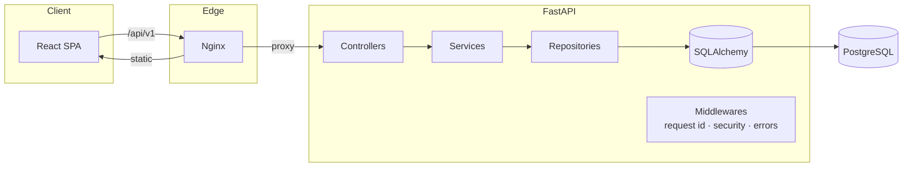

# Inventory & Order Management System

A production-grade, full-stack inventory and order management platform built with a layered FastAPI
backend, a typed React dashboard, and a containerised deployment pipeline.

> Controller → Service → Repository → Database. Strict typing front-to-back. Atomic, rollback-safe
> order processing with real inventory reservation.

---

## Table of contents

- [Features](#features)
- [Tech stack](#tech-stack)
- [Architecture](#architecture)
- [Project structure](#project-structure)
- [Quick start](#quick-start)
- [Local development (without Docker)](#local-development-without-docker)
- [Configuration](#configuration)
- [Testing & quality](#testing--quality)
- [API overview](#api-overview)
- [Documentation](#documentation)

---

## Features

**Backend**

- Layered clean architecture with strict separation of concerns.
- Atomic order creation: validates the customer, validates products, checks stock, reserves
  inventory with row-level locking, computes totals, and persists — all inside one transaction that
  rolls back fully on any failure.
- Custom domain exception hierarchy mapped to consistent JSON error envelopes.
- Soft delete for products and customers — archived records preserve order history and are hidden
  from active views and new orders.
- Pagination, filtering, and multi-column sorting on every list endpoint.
- Structured (JSON) logging with per-request correlation IDs.
- Pydantic v2 validation everywhere; database-level constraints as a second line of defence.
- Security headers, configurable CORS, and 12-factor environment configuration.
- Unit-tested business logic (services, repositories, schemas) with pytest — 90%+ coverage on the core.

**Frontend**

- Linear/Stripe-inspired SaaS dashboard with light, dark, and system themes.
- Fully responsive (mobile → large screens) using CSS Grid and Flexbox.
- Reusable, typed, composable component library (buttons, tables, dialogs, drawers, skeletons,
  empty/error states, forms, charts, and more).
- TanStack Query for caching, retries, stale-time, and cache invalidation.
- React Hook Form + Zod for inline validation and server error mapping.
- Dashboard analytics with Recharts; live-calculating multi-line order builder.
- Loading skeletons, empty states, error states, confirmation dialogs, and toasts on every screen.
- Unit-tested logic (validation schemas, hooks, stores, API client) with Vitest.

---

## Tech stack

| Layer        | Technologies                                                                 |
| ------------ | ---------------------------------------------------------------------------- |
| Backend      | Python 3.12, FastAPI, SQLAlchemy 2.0, Alembic, Pydantic v2, PostgreSQL        |
| Frontend     | React 18, TypeScript, Vite, TanStack Query, React Hook Form, Zod, Tailwind    |
| UI           | Radix UI primitives (shadcn-style), Recharts, Sonner, Lucide, Zustand         |
| Tooling      | Ruff, Black, Mypy, Pytest · ESLint, Prettier, tsc                             |
| Infra        | Docker, Docker Compose, Nginx, multi-stage builds, health checks             |

---

## Architecture



Request flow: **Controller** handles HTTP concerns only, **Service** owns business rules, **Repository**
owns persistence, and the **database** enforces invariants with constraints. See
[`docs/ARCHITECTURE.md`](docs/ARCHITECTURE.md) for the full breakdown and design decisions.

---

## Project structure

```
.
├── backend/                # FastAPI application
│   ├── src/
│   │   ├── api/            # Controllers (HTTP) + dependencies + router
│   │   ├── services/      # Business logic
│   │   ├── repositories/  # Database access
│   │   ├── schemas/       # Pydantic request/response models
│   │   ├── models/        # SQLAlchemy ORM models
│   │   ├── middlewares/   # Request context, security headers, exception handlers
│   │   ├── exceptions/    # Domain exception hierarchy
│   │   ├── core/          # Config + structured logging
│   │   ├── db/            # Engine, session, declarative base
│   │   └── utils/         # Pagination helpers
│   ├── alembic/           # Migrations
│   ├── scripts/           # Entry point + seed
│   └── tests/             # Unit tests (pytest)
├── frontend/               # React + Vite dashboard
│   └── src/
│       ├── api/           # HTTP client, query client, query keys
│       ├── features/      # Feature modules (products, customers, orders, dashboard)
│       ├── components/    # UI library + layout
│       ├── pages/         # Route pages
│       ├── hooks/         # Reusable hooks
│       ├── layouts/       # App shell + navigation
│       ├── routes/        # Route definitions
│       ├── store/         # Zustand UI state (theme, sidebar)
│       ├── types/         # Shared types
│       └── theme/         # Tailwind tokens + globals
├── docs/                   # Architecture, database, API, deployment guides
├── docker-compose.yml
└── setup.sh                # Generates backend/.env and frontend/.env
```

---

## Quick start

Prerequisites: Docker and Docker Compose.

**First run (and any time you change code or config)** — builds the images, runs migrations, and
seeds sample data:

```bash
docker compose up --build
```

**Afterwards, to stop and run it again** — reuses the existing build and keeps your database (no
rebuild, no re-seed):

```bash
docker compose stop      # stop the app
docker compose start     # run it again
```

Docker Compose defines its own values, so it needs no env files — just run the command above. The
`backend/.env` / `frontend/.env` files (generated by `./setup.sh`) are only for running the apps
locally without Docker.

| Service        | URL                                |
| -------------- | ---------------------------------- |
| Frontend       | http://localhost:8080              |
| API            | http://localhost:8000/api/v1       |
| Swagger UI     | http://localhost:8000/docs         |
| ReDoc          | http://localhost:8000/redoc        |

Migrations run automatically on startup, and the database is seeded with sample data the first time
it boots, so the dashboard has content immediately.

Handy commands while developing:

```bash
docker compose up -d --build backend   # rebuild and restart just one service after a code change
docker compose logs -f                 # tail logs
docker compose down                    # stop and remove containers (add -v to drop the DB volume)
```

---

## Local development (without Docker)

The Docker workflow above is all you need to run the project. This section is only for running the
services natively on your machine (e.g. for fast hot-reload outside containers). First generate the
env files:

```bash
./setup.sh        # add --force to overwrite existing files
```

You also need a reachable PostgreSQL — either run one via Docker, or point `DATABASE_URL` in
`backend/.env` at your own instance:

```bash
docker compose up -d postgres     # Postgres on localhost:5432
# — or use your own PostgreSQL and set DATABASE_URL in backend/.env
```

**Backend** — http://localhost:8000

```bash
cd backend
python -m venv .venv && source .venv/bin/activate
pip install -r requirements-dev.txt
alembic upgrade head
uvicorn src.main:app --reload
```

**Frontend** — http://localhost:5173 (proxies `/api` to the backend on :8000)

```bash
cd frontend
npm install
npm run dev
```

---

## Configuration

Configuration is environment-driven. Docker runs entirely from the values defined in
`docker-compose.yml`. For local (non-Docker) development, `./setup.sh` generates two gitignored env
files from their committed `.env.example` templates:

| File            | Used by                   | Purpose                          |
| --------------- | ------------------------- | -------------------------------- |
| `backend/.env`  | local backend (`uvicorn`) | DB connection, CORS, logging     |
| `frontend/.env` | local frontend (`vite`)   | API base URL / proxy target      |

| Variable           | Scope    | Default                          | Description                          |
| ------------------ | -------- | -------------------------------- | ------------------------------------ |
| `DATABASE_URL`     | backend  | local Postgres DSN               | SQLAlchemy connection string         |
| `CORS_ORIGINS`     | backend  | `http://localhost:5173`          | Comma-separated allowed origins      |
| `LOG_JSON`         | backend  | `true`                           | Toggle structured JSON logging       |
| `ENVIRONMENT`      | backend  | `development`                    | `development`/`staging`/`production` |
| `VITE_API_BASE_URL`| frontend | `/api/v1`                        | API base path                        |

---

## Testing & quality

```bash
# Backend — unit tests (pytest), fails under 80% coverage
cd backend && source .venv/bin/activate
pytest
ruff check src tests
black --check src tests
mypy src

# Frontend — unit tests (Vitest) + checks
cd frontend
npm run test            # or: npm run test:coverage
npm run lint
npm run typecheck
npm run build
```

---

## API overview

Base URL: `/api/v1`

| Method | Endpoint                  | Description                              |
| ------ | ------------------------- | ---------------------------------------- |
| GET    | `/dashboard/summary`      | Aggregated metrics + trends              |
| GET    | `/products`               | List (page, page_size, sort_by, order, search) |
| POST   | `/products`               | Create product                           |
| GET    | `/products/{id}`          | Get product                              |
| PATCH  | `/products/{id}`          | Update product                           |
| DELETE | `/products/{id}`          | Delete product                           |
| GET    | `/customers`              | List customers                           |
| POST   | `/customers`              | Create customer                          |
| GET    | `/customers/{id}`         | Get customer                             |
| PATCH  | `/customers/{id}`         | Update customer                          |
| DELETE | `/customers/{id}`         | Delete customer                          |
| GET    | `/orders`                 | List orders (filter by `status`)         |
| POST   | `/orders`                 | Create order (atomic stock reservation)  |
| GET    | `/orders/{id}`            | Order detail with items + customer       |
| PATCH  | `/orders/{id}/status`     | Update order status                      |

Full request/response examples live in [`docs/API.md`](docs/API.md).

---

## Documentation

- [Architecture & design decisions](docs/ARCHITECTURE.md)
- [Database schema & ER diagram](docs/DATABASE.md)
- [API reference & examples](docs/API.md)
- [Deployment guide](docs/DEPLOYMENT.md)
