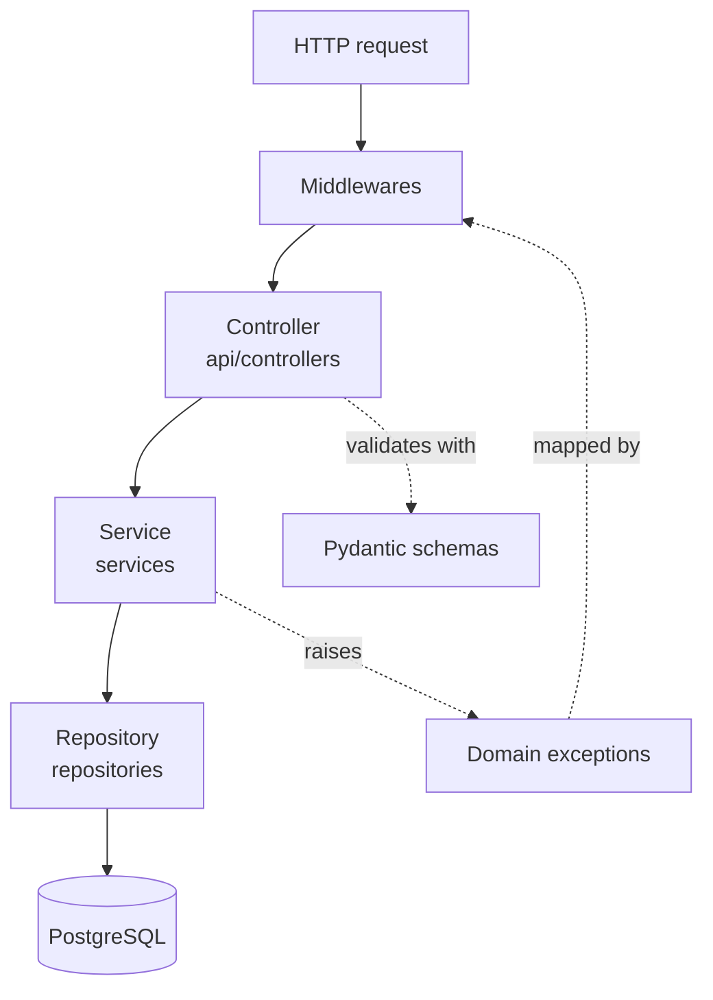
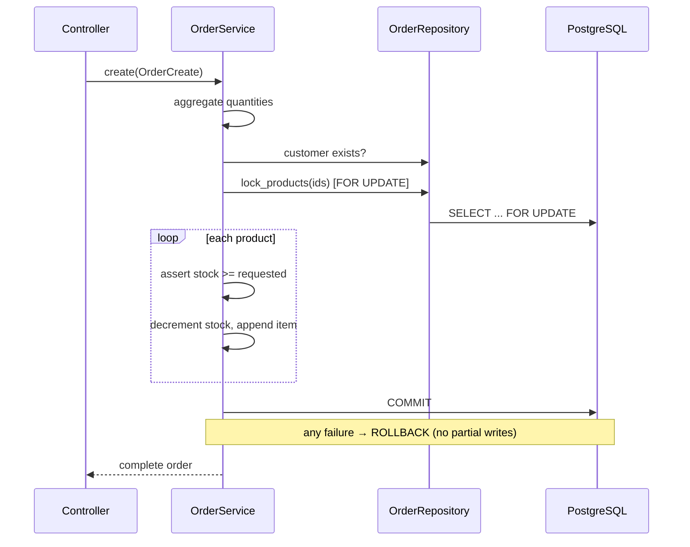

# Architecture & Design Decisions

## Layered architecture

The backend follows a strict four-layer flow. Each layer depends only on the layer beneath it.



| Layer        | Responsibility                                      | Must NOT contain                     |
| ------------ | --------------------------------------------------- | ------------------------------------ |
| Controller   | HTTP wiring, status codes, (de)serialization        | business rules, SQL                  |
| Service      | Business logic, transactions, orchestration         | HTTP types, raw SQL strings          |
| Repository   | Query construction and persistence                  | business rules                       |
| Model/DB     | Schema, constraints, relationships                  | application logic                    |

### Why this matters

- **Testability** — business logic (services, repositories, schemas) is unit-tested directly against
  an in-memory database, with no HTTP layer to spin up. The frontend's pure logic (validation schemas,
  hooks, stores, API client) is unit-tested with Vitest.
- **Replaceability** — the persistence layer can be swapped (e.g. read replicas, caching) without
  touching business rules.
- **Single source of truth for rules** — all invariants live in services and are mirrored by database
  constraints, so neither the API nor a rogue migration can corrupt data.

## Order processing: atomic & rollback-safe

Order creation is the critical transactional path. The service:

1. Aggregates requested quantities per product (deduplicating repeated lines).
2. Validates the customer exists.
3. Locks the involved product rows with `SELECT … FOR UPDATE` to prevent oversell under concurrency.
4. Validates every product exists and has sufficient stock.
5. Decrements stock, builds order items, and computes the total.
6. Commits in a single transaction; any exception triggers a full `rollback`.



## Error handling

A single exception hierarchy (`src/exceptions/domain.py`) carries an HTTP status, a stable
`error_code`, and optional structured `details`. Global handlers translate them — plus framework and
integrity errors — into one consistent envelope:

```json
{ "success": false, "message": "Product not found", "error_code": "PRODUCT_NOT_FOUND" }
```

This keeps controllers free of try/except noise and guarantees clients a predictable contract.

## Validation strategy (defence in depth)

1. **Frontend** — Zod schemas give instant inline feedback.
2. **API boundary** — Pydantic v2 validates and normalizes every payload (emails lowercased, SKUs
   upper-cased, prices/quantities range-checked). The frontend is never trusted.
3. **Database** — `UNIQUE`, `CHECK (price > 0)`, `CHECK (quantity_in_stock >= 0)`, and foreign keys
   enforce invariants even against direct DB access.

## Observability

Structured JSON logs include a per-request `request_id` (propagated via `X-Request-ID`) using a
`ContextVar`, so a single request can be traced across `request.start`, service logs, and
`request.end` with latency.

## Frontend architecture

- **Feature-first modules** (`features/products`, `features/orders`, …) co-locate API calls, query
  hooks, Zod schemas, and feature components.
- **Server state** is owned exclusively by TanStack Query (caching, retries, invalidation).
  **Client/UI state** (theme, sidebar) is the only thing in Zustand — per the brief.
- **A small typed component library** (`components/ui`) provides composable primitives so pages stay
  declarative and consistent.
- **The API client** converts non-2xx responses into a typed `ApiError`, exposing `error_code` and
  field-level errors that forms map back onto inputs.

## Key trade-offs

| Decision                              | Rationale                                                            |
| ------------------------------------- | ------------------------------------------------------------------- |
| Pessimistic row locks on order create | Correctness over throughput for inventory; avoids oversell          |
| Synchronous SQLAlchemy                | Simpler, fewer foot-guns; the workload is not I/O-bound at this size |
| Numeric/Decimal for money             | Avoids floating-point rounding errors on prices and totals          |
| Radix + hand-rolled components        | Accessible primitives without a heavy component framework           |
| Manual chunking in Vite               | Smaller initial payload; charts/forms load as separate cacheable chunks |
