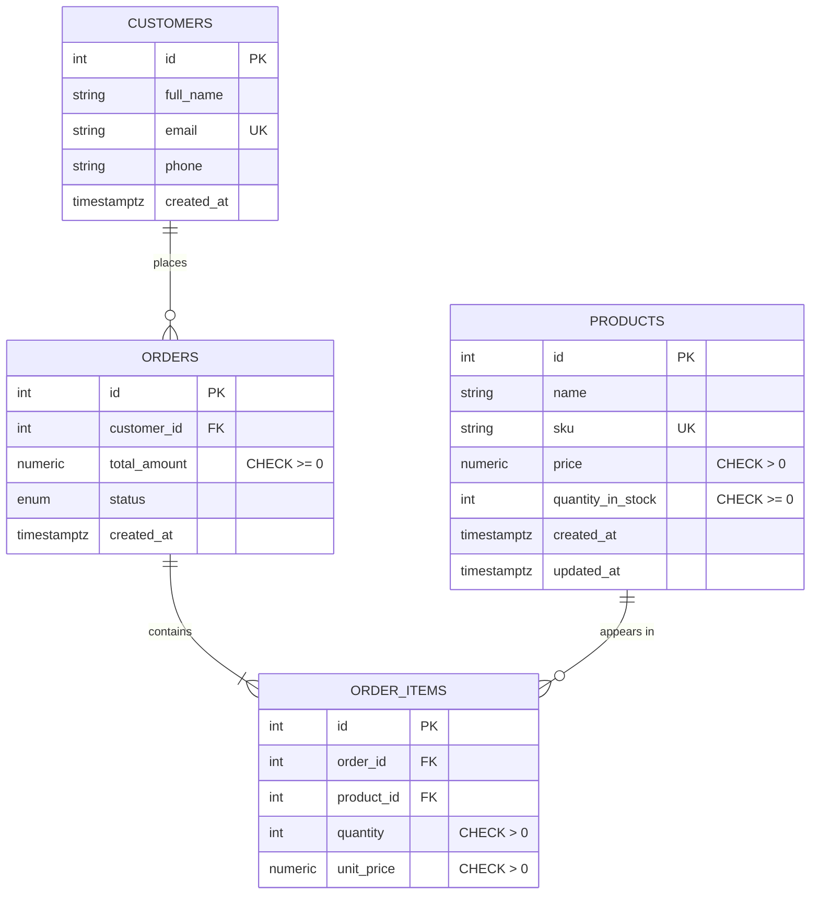

# Database Schema

PostgreSQL, normalized to third normal form. Money is stored as `NUMERIC` to avoid floating-point
errors. All invariants are enforced at the database level in addition to the application layer.

## ER diagram



## Tables

### `products`

| Column              | Type           | Constraints                              |
| ------------------- | -------------- | ---------------------------------------- |
| id                  | integer        | PK                                        |
| name                | varchar(255)   | not null                                  |
| sku                 | varchar(64)    | not null, unique, indexed                 |
| price               | numeric(12,2)  | not null, `CHECK (price > 0)`             |
| quantity_in_stock   | integer        | not null, `CHECK (quantity_in_stock >= 0)`|
| created_at          | timestamptz    | not null, default now()                   |
| updated_at          | timestamptz    | not null, default now(), on update now()  |
| deleted_at          | timestamptz    | nullable (soft delete; `NULL` = active)   |

### `customers`

| Column      | Type         | Constraints              |
| ----------- | ------------ | ------------------------ |
| id          | integer      | PK                       |
| full_name   | varchar(255) | not null                 |
| email       | varchar(320) | not null, unique, indexed|
| phone       | varchar(32)  | nullable                 |
| created_at  | timestamptz  | not null, default now()  |
| deleted_at  | timestamptz  | nullable (soft delete; `NULL` = active) |

### `orders`

| Column        | Type          | Constraints                                   |
| ------------- | ------------- | --------------------------------------------- |
| id            | integer       | PK                                            |
| customer_id   | integer       | not null, FK → customers(id) `ON DELETE RESTRICT`, indexed |
| total_amount  | numeric(14,2) | not null, default 0, `CHECK (total_amount >= 0)`|
| status        | order_status  | not null, default `'pending'`                 |
| created_at    | timestamptz   | not null, default now()                       |

`order_status` enum: `pending`, `confirmed`, `shipped`, `delivered`, `cancelled`.

### `order_items`

| Column      | Type          | Constraints                                        |
| ----------- | ------------- | -------------------------------------------------- |
| id          | integer       | PK                                                 |
| order_id    | integer       | not null, FK → orders(id) `ON DELETE CASCADE`, indexed |
| product_id  | integer       | not null, FK → products(id) `ON DELETE RESTRICT`, indexed |
| quantity    | integer       | not null, `CHECK (quantity > 0)`                   |
| unit_price  | numeric(12,2) | not null, `CHECK (unit_price > 0)`                 |

`unit_price` snapshots the product price at order time, so historical orders are unaffected by later
price changes.

## Soft deletes

Products and customers are **soft-deleted**: `DELETE` sets `deleted_at = now()` instead of removing
the row, so orders keep valid references and historical data is preserved. Soft-deleted records are
excluded from every list / detail / search endpoint and from dashboard counts, and cannot be used in
new orders — but they still appear inside the historical orders that reference them. `email` and `sku`
uniqueness spans all rows (including archived), so an archived identifier is not freed for reuse.

## Referential integrity (database backstop)

The foreign keys remain as a safety net for direct database access (the application uses soft delete
and never hard-deletes products or customers):

- `order_items.product_id` → `products.id` is `RESTRICT` — a product in any order cannot be hard-deleted.
- `order_items.order_id` → `orders.id` is `CASCADE` — deleting an order removes its items.
- `orders.customer_id` → `customers.id` is `RESTRICT` — a customer with orders cannot be hard-deleted.

## Migrations

Schema is managed by Alembic. The baseline lives in `backend/alembic/versions/0001_initial_schema.py`.

```bash
alembic upgrade head            # apply
alembic downgrade -1            # revert one
alembic revision --autogenerate -m "message"
```
